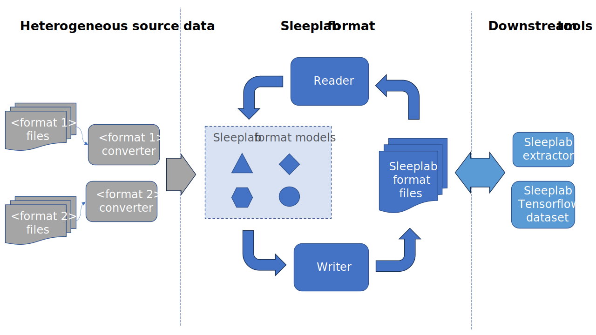
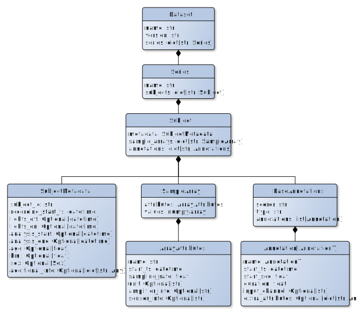
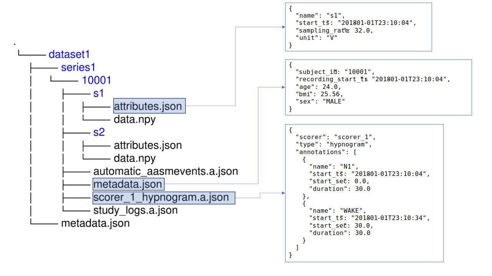

# Concepts

*Fig. 1: Overview of the Sleeplab format ecosystem.*

A schematic diagram of the Sleeplab format (SLF) is shown in Fig. 1. The heterogeneous source data consists of the different file formats used with different PSG recording software. When a new dataset comes, the first task is to convert it to SLF. The *converters* contain the uggly part of wrangling the source data to SLF models. After that, the *writer* can be used to save the SLF dataset on disk. The SLF dataset can then be read to memory with the *reader*. Both reader and writer validate the data types and structures when they are used.

*Fig. 2: Class diagram of the SLF base classes.*

SLF uses Pydantic models to represent the data. Pydantic models provides automatic validation of data types for Python classes. The compositon of models in SLF is shown in Fig. 2. A SLF dataset consists of any number of series, which can contain any number of subjects. Subjects consist of metadata, sample arrays, and annotations.

*Fig. 3: The SLF file format*

SLF utilizes the file system to represent the dataset hierarchy on disk (Fig. 3). Datasets are folders, series are folders, and subjects are folders. All metadata and annotations are stored in plain-text JSON files by default. The PSG signals are stored in their own folders. The actual signal is stored in a binary format (NumPy files by default), and all metadata related to the signal is stored  in a JSON file.
